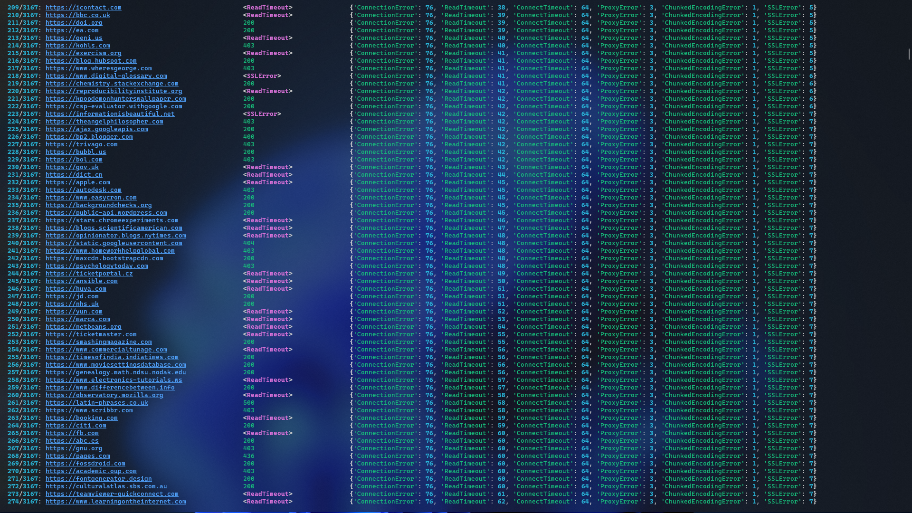

# IRUtils

This repo is a tracked log of the scripts I write for myself, due to regional network restrictions.

## URLBrute

A Python utility for batch checking the reachability of URLs.


### Overview

URLBrute sends HTTP GET requests to a list of provided URLs and reports which ones are reachable, along with any connection errors encountered.

### Usage

```bash
python URLBrute.py <domains_file>
```

If no file is specified, defaults to `domains.txt` in the same directory.

#### Input Format

Provide one domain per line in a text file:

```
example.com
google.com
github.com
```

### Features

- Automatic domain-to-URL handling (if necessary)
- Request timeout (5 seconds default)
- Logging of all requests and errors

### Requirements

```
requests
rich
```

### Output

- Successfully reachable URLs are collected in `checker.reachable` (this is supposed to be used in domains' uniqueness handling, later)
- Results are immediately logged to `.log` file (for restorability, in case of any interruptions)
- Status codes and error types displayed in console

### Acknowledgments

Special thanks to [atakanaltok](https://github.com/atakanaltok)'s repository, [awesome-useful-websites](https://github.com/atakanaltok/awesome-useful-websites), for providing useful web resources and tools. A list of these awesome websites (possibly with exclusions/additions) has been provided in [domains.txt](domains.txt) so you can test the functionality of the script.
